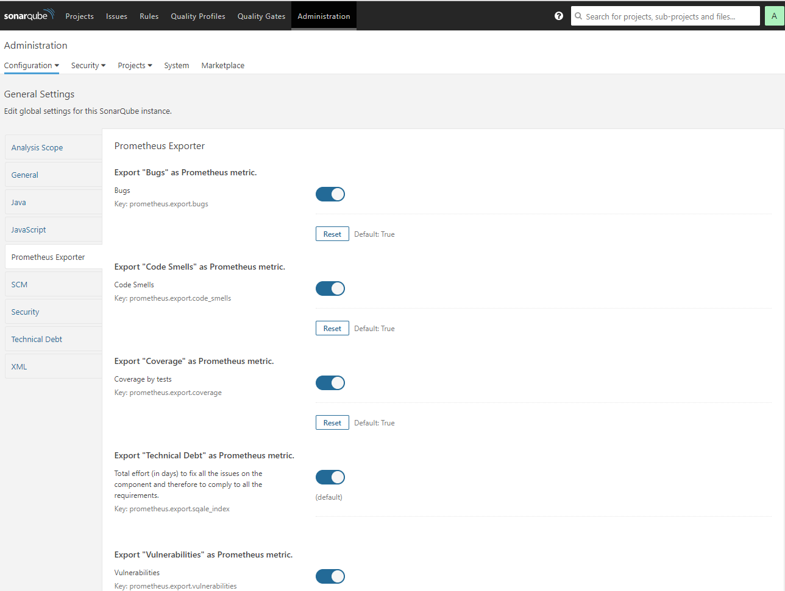
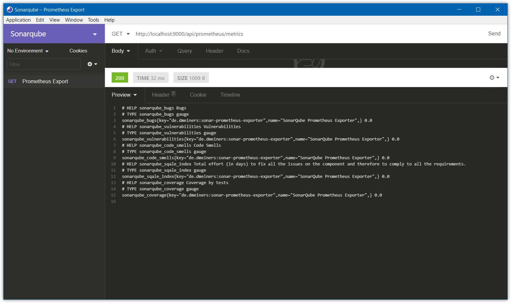
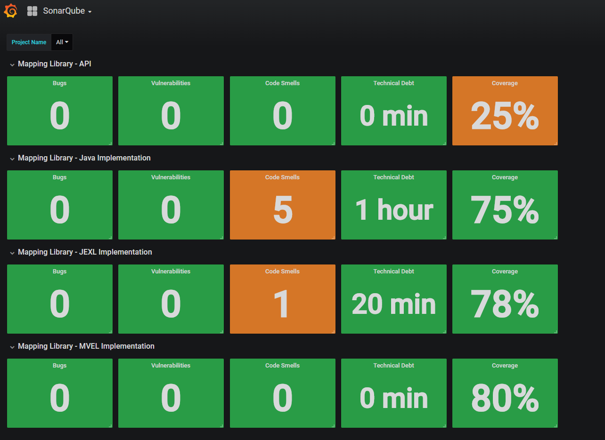

<h1 align="center">Sonarqube Prometheus Exporter</h1>
<h4 align="center">Prometheus Exporter Plugin for SonarQube.</h4>

<p align="center">
  <a href="https://travis-ci.com/dmeiners88/sonarqube-prometheus-exporter">
    
  </a>
  <a href="https://sonarcloud.io/dashboard?id=de.dmeiners%3Asonar-prometheus-exporter">
    
  </a>
  <a href="https://github.com/dmeiners88/sonarqube-prometheus-exporter/releases">
    
  </a>
  <a href="https://github.com/dmeiners88/sonarqube-prometheus-exporter/blob/develop/LICENSE">
    
  </a>
  <a href="https://semver.org/spec/v2.0.0.html">
    
  </a>
</p>

<p align="center">
  <a href="#features">Features</a> •
  <a href="#requirements">Requirements</a> •
  <a href="#installation">Installation</a> •
  <a href="#usage">Usage</a> •
  <a href="#screenshots">Screenshots</a>
</p>

## Features
* Configure which metrics to export

## Requirements
* SonarQube 7.x

## Installation

1. Download [latest snapshot release](https://github.com/dmeiners88/sonarqube-prometheus-exporter/releases/tag/v1.0.0-SNAPSHOT-2018-07-04)
2. Drop `sonar-prometheus-exporter-1.0.0-SNAPSHOT.jar` into `$SONARQUBE_HOME/extensions/plugins`.
3. Restart the SonarQube server.

## Usage

1. Configure which metrics you want to export under Administration &rarr; Configuration &rarr; General Settings &rarr; Prometheus Exporter
2. Add a scrape config to your Prometheus instance similar to this:
```yaml
scrape_configs:
  - job_name: 'sonarqube'
    metrics_path: '/api/prometheus/metrics'
    static_configs:
      - targets: ['localhost:9000']
```
3. Alternatively, point your HTTP client to `http://localhost:9000/api/prometheus/metrics`

## Screenshots
<p align="center">
  
  
  
</p>
